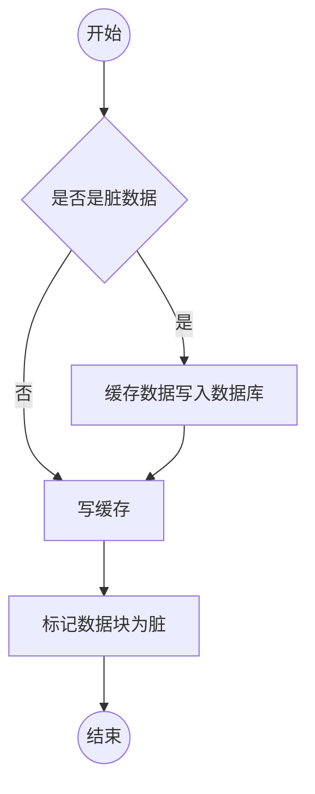

## 缓存的使用姿势

### 旁路缓存策略

1. 更新数据库后再更新缓存（两种优化方案：1.添加分布式锁，只允许一个线程修改同步执行更新操作；2.更新缓存的时候，缓存有效时间设置较短时间）
2. 更新数据库后删除缓存(也会出现缓存不一致的情况)

### 读穿/写穿策略

 业务只与缓存打交道

读穿：先查询缓存数据是否存在，如果存在，直接返回数据，否则由缓存同步组件从数据库中同步加载数据

写穿：先查询要写入的缓存数据是否存在，如果存在，则更新缓存数据，并由缓存同步组件更新数据库；否则，缓存数据不存在，1.先写入缓存到相应位置，再由同步组件更新到数据库中；2直接写入到数据库中，不再写入缓存（减少写入缓存操作，提高写入性能）

### 写回策略

  在写入的数据的时候只写入缓存数据，并把缓存块标记为"脏"的，而脏块只有再次使用时才会将其中的数据写入到数据库缓存中。

在缓存数据不存在的时候，要先写入缓存的同时写入数据库数据，并把数据标记为脏。

读策略：直接读缓存数据，如果数据存在，则直接返回数据，否则，找到一个可用的缓存块，如果这个缓存块是脏的，则把缓存块之前的数据更新写入到数据库，并把数据库数据写入到缓存，如果缓存块不是脏的，则把数据库数据写入缓存，并设置缓存块为非脏。

### 总结

一般采用旁路缓存策略更新缓存，它也是分布式系统中最常见的的策略。

读穿/写穿策略一般需要缓存服务提供同步支持，该策略又有同步和异步两种，可根据实际情况选择

写回策略一般用在计算机体系中。

